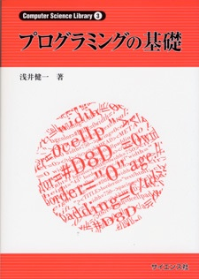
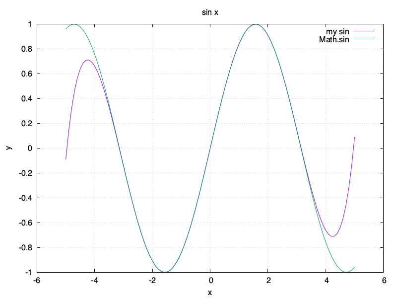
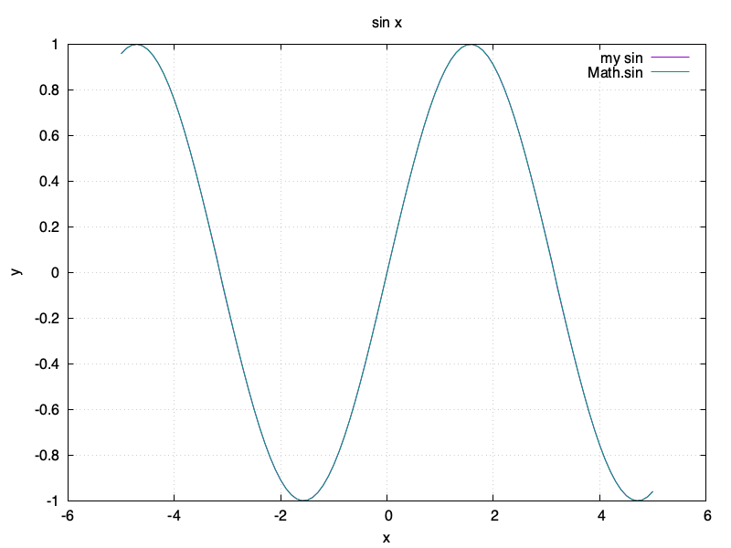
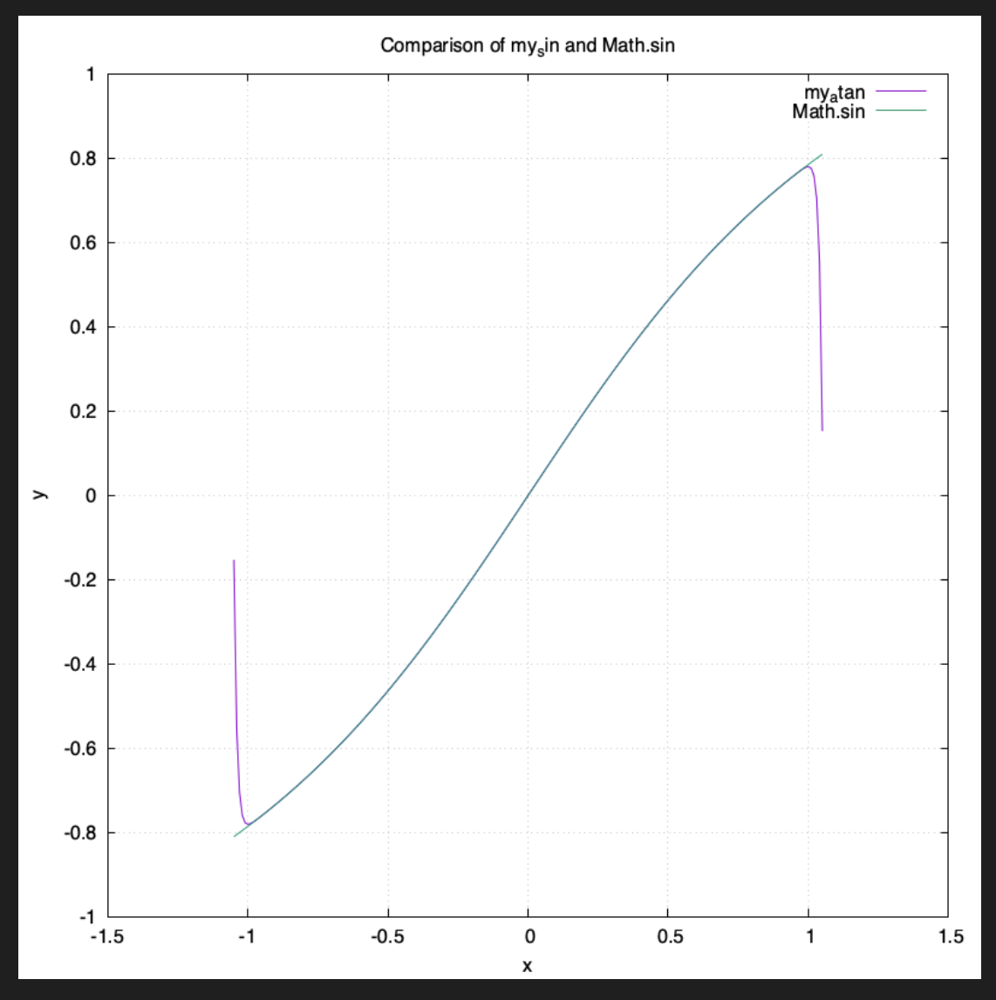
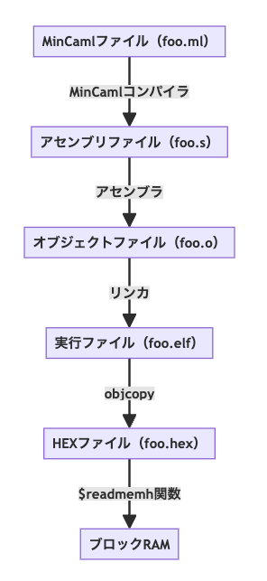

---

marp: true
paginate: true
theme: gaia
class:
  - invert
math: mathjax
---

<!-- _class: lead invert -->

# 自作 CPU 上で<br/>例のレイトレを動かした話 🚀

第5回 自作CPUを語る会
2025.04.12
@htkymtks

<!--
こんにちは。

今日は「自作CPUの上で例のレイトレを動かした話」をします。
-->

---

## :bird: 自己紹介

- はたけやまたかし
- 永和システムマネジメント所属
  - RubyでWEBアプリケーション開発
- Twitter（現X）： @htkymtks
  

<!--
まず自己紹介です。

はたけやまたかしと申します。

永和システムマネジメントという会社で、プログラマとして、RubyでWEBアプリケーションを書いて暮らしています。

また、ダジャレが好きなので、思いついたダジャレをTwitterへ放流したりしています。

こちらは「最近のお気に入りツイート」になります。
-->

---

## 🛠️ 趣味

- 低レイヤプログラミング
  - 自作CPU
    - TD4, RISC-V, Turing Complete
  - コンパイラ
    - MinCaml移植（AArch64, RISC-V）
    - minrubyc
      - https://blog.agile.esm.co.jp/entry/minruby-compiler
  - RISC-Vシミュレータ
    - https://blog.agile.esm.co.jp/entry/2022/06/10/115327

<!--
低レイヤプログラミングが趣味で、
CPUや、シミュレータや、コンパイラを自作して遊んでいます。
-->

---

## 🙂 今日お話しすること


- CPUの自作からレイトレまでの流れ

<!--
今日お話しすることです。

先日、RISC-V CPUを自作して、その上で東大CPU実験で有名な、例のレイトレーサーを動かしました。

今日は、自分もレイトレ動かしたい！と思っている人向けに、CPUの自作からレイトレまでの流れについてお話ししようと思います。
-->

---

### 🪩 レイトレが動く様子

<!--
早速ですが、自作CPUの上でレイトレが動く様子をお見せしたいと思います。

レイトレを開始したら、終了を知らせる青いLEDが光るまで待機します。

（動画スタート）

（青いLEDが光ったら）

今青いLEDが光ったのでレイトレ終了です。レイトレが出力した画像を確認します。

以上、レイトレでした。
-->

<video src="raytracer-demo.mp4"  width="900" controls></video>

---

## 🗼東大CPU実験とは？

- 東大理学部情報科学科の名物実験
- 自分たちでCPU、コンパイラ、シミュレーターなどを作成
- レイトレーシングの速さを競う
- 毎年投稿されるCPU実験の記事が楽しみ😁


<!--
次に、東大CPU実験について知らない方もいらっしゃると思うので、簡単にご説明します。

東大CPU実験とは、東大 理学部 情報科学科 の名物実験で、4人1組のグループに分かれて、CPUやコンパイラやシミュレータを自作し、どれだけ速いレイトレーサーが作れるかを目指す実験です。

CPU実験の体験記が毎年WEBに投稿されるので、いつも楽しみにしていて、
それらを読んでるうちに「自分でもやってみたい！」と思い、ひとりCPU実験を始めました。
-->

---

## 👨‍👩‍👧‍👦 CPU実験の４つの係

- コア係
  - FPGAボード上でVerilogなどでCPUを実装
- コンパイラ係
  - MinCamlコンパイラを、自分たちのCPU向けに移植
- シミュレータ係
  - アセンブラとデバッグ用のシミュレータの作成
- FPU係
  - 浮動小数点演算器（FPU）の作成
  - ライブラリ関数の実装

<!--
CPU実験は、主に4つの係に分かれて作業を行います。

コア係は、FPGAボード上で動くCPUをVerilogなど実装します。

コンパイラ係は、MinCamlという言語のコンパイラを、自分たちのCPU向けに移植します。

シミュレータ係は、アセンブラの作成と、デバッグ用のシミュレータの作成を行います。

FPU係は、CPUに組み込む浮動小数点演算器（FPU）の実装と、浮動小数点計算を行うライブラリ関数の作成を行います。
-->

---

## ✅ CPU実験の４つの係

- コア係 → ✅CPUを実装
- コンパイラ係 → ✅MinCamlコンパイラを移植
- シミュレータ係 → ❌既存のRISC-Vシミュレータを利用
- FPU係
  - 浮動小数点演算器 → ❌既存のFPUコアを利用
  - ライブラリ関数の実装 → ✅実装する

<!--
そのうち、私が実際に行ったのは、

コア係のCPUの実装と、
コンパイラ係のMinCamlコンパイラの移植と、
FPU係のライブラリ関数の実装を行いました。

シミュレータは、既存のRISC-Vシミュレータを利用しましたし、
FPUは、github で見つけた既存のFPUコアを利用しました。
-->

---

## 🪩 レイトレを動かす手順

- 1️⃣ FPGAボードを用意
- 2️⃣ CPUを作成
- 3️⃣ MinCamlコンパイラの移植
- 4️⃣ ライブラリ関数の実装
- 5️⃣ レイトレの組み込み

<!--
レイトレを動かす手順はこんな感じです。

（見てもらう）

説明の都合上、5つのステップに分けて説明するのですが、実際の手順はこんなに厳密に分かれてはおらず、各手順を行ったり来たりしながら開発を行うことになります。
-->

---

<!-- _class: lead invert -->

# 1️⃣ FPGAボードを用意

---

## 💸 使ってるFPGAボード

<!--
まずはFPGAボードを用意します。私が使っているFPGAボードは「ULX3S」という、Lattice ECP5 を搭載したボードで、スペックはこんな感じです。

ちなみにこの ULX3S、お気に入りのFPGAボードなのですが、2021年に購入当時は 1万8000円だったお値段が、2025年現在は 3万8000円に値上がりしていて、気軽にオススメしづらくなってしまいました...
-->


- Radiona ULX3S 85F
  - FPGA： Lattice ECP5
  - LUT数： 85K LUT
  - SDRAM： 32MB
  - ブロックRAM： 486KB
- 価格
  - 2021年: 1万8000円
  - 2025年: 3万8000円 💸💸💸

---

### 🐀 ULX3S 以外のFPGAボードでも動く？

<!--
みなさんのお手持ちのFPGAボードでレイトレが動くかどうか気になってるかと思いますが、こちらの条件を満たせば、レイトレを動かせると思います。

まず、LUTが12K程度必要です。Tang Nano 9Kだと足りなくて、Tang Nano 20Kなら収まりそうな気がします。

この12Kという数字は、私が作成したCPUのLUT数から来てるので、CPUをうまいこと作ればもう少し圧縮できるかもしれません。

次にSDRAMが必要です。スタックとヒープ合わせて5MBが必要になるので、SDRAMなどの大容量メモリが必要になります。

最後に、これは必須ではないのですが、ブロックRAMが 250KB 程度あると、ブート領域にレイトレ全体がすっぽりと収まるのでおすすめです。

レイトレがブート領域に収まらない場合、ローダーなどが必要になります。
-->

- 必須
  - LUT数: 12000程度（作成したCPUが 1万2000 LUT）
    - ❌ Tang Nano 9K、✅ Tang Primer 20K
    - FPUコアが大量にLUTを使用する
  - SDRAM必須（5MB以上、スタック1MB + ヒープ4MB）
- 推奨
  - ブロックRAM: 250KB以上（レイトレのサイズがこれくらい）
    - 足りなければ「ローダー」が必要

---

<!-- _class: lead invert -->

# 2️⃣ CPUの作成

<!--
FPGAボードを用意したら、次はCPUを作成します。
-->

---

## 🧮 作成したCPUのスペック

<style scoped>section li { font-size: 0.9em; }</style>

- CPUアーキテクチャ
  - 32ビットRISC-V（RV32IF）
    - 整数演算 + 単精度浮動小数点演算
    - コンパクト命令には非対応
- メモリ構成
  - ROM（ブロックRAM）：256KB
  - RAM（SDRAM）：32MB
- 周辺機器（メモリマップトIO）
  - UART
  - LED（8ビット）

<!--
今回作成したCPUのアーキテクチャは、32ビットRISC-Vです。整数演算と単精度浮動小数点演算ができます。また、コンパクト命令には対応しませんでした。

浮動小数点演算に対応しているのは、レイトレを動かすのに必要だからです。浮動小数点の精度は、単精度にするか倍精度にするか悩んだのですが、単精度で大丈夫でした。

周辺機器としてUARTを備えていて、メモリマップトIOでアクセスします。レイトレの結果をパソコンへ送ったりするのに利用します。
-->

---

## 🧰 開発ツール

- HDL
  - System Verilog
- 合成・配置配線ツール
  - yosys + nextpnr
  - macOSで動く🍎
- OSS CAD Suite をインストールすると全部ついてくる
  - https://github.com/YosysHQ/oss-cad-suite-build
  - （Gowin の FPGA も一部サポート）

<!--
言語は System Verilog で開発しました。オープンソースな開発ツール、yosys と nextpnr を利用してビルドしています。

yosys と nextpnr は、インストールが容易で、macOS ネイティブでも動作するし、ビルドも早いので気に入っています。
-->

---

### 📙 CPU作成の参考書

- CPU作成の基本
  - ディジタル回路設計とコンピュータアーキテクチャ（RISC-V版）
- RISC-Vの仕様
  - RISC-V原典
- System Verilog の書き方
  - FPGA Prototyping by SystemVerilog Examples


<!--
最近はCPUの作り方に関しての本がたくさん出ているので、CPUの作成方法については説明しません。

代わりに、私が参考にした書籍を紹介します。

CPU作成の基本に関しては、ディジタル回路設計とコンピュータアーキテクチャ

RISC-Vの仕様については、RISC-V原典

System Verilogの書き方については、FPGA Prototyping by SystemVerilog Examples

が参考になりました。
-->

---

## 📜 自作CPUに実装した命令一覧

- 整数命令（RV32Iのサブセット）
  - lw, sw, add, addi, sub, and, or, xor, slt, sltu, beq, bne, ble, bne, blt, bgt, bge, jal, jalr, lui, auipc, ori, srl, sra, sll
- 浮動小数点命令（RV32Fのサブセット）
  - flw, fsw, fadd_s, fsub_s, fmul_s, fdiv_s, fcvt_s_w, fcvt_w_s, fsgnj_s, fsgnjn_s, feq_s, flt_s, fle_s, fmv_x_w, fmv_w_x

<!--
自作CPUに実装した命令はこちらになります。ご参考までに。
-->

---

<!-- _class: lead invert -->

# 3️⃣ MinCamlコンパイラの移植

<!--
次はMinCamlコンパイラの移植についてです。
-->

---

## 🐪 MinCamlコンパイラとは

- https://github.com/esumii/min-caml
- 教育用コンパイラ
- OCamlのサブセット
- MinCamlはOCamlで書かれている

<!--
MinCamlは教育用のコンパイラで、東大のコンパイラの授業などで使われています。
MinCamlはOCamlという言語のサブセットです。
また、MinCaml自身もOCamlで書かれています。
-->

---

## 🐪🪩 MinCamlとレイトレ

- CPU実験のレイトレはMinCaml製
- MinCamlを自作CPUへ移植することで、自作CPUの上でレイトレが動く
- レイトレはMinCamlリポジトリの中に
  - 📂 min-caml/
    - 📂 min-rt/
      - 📄 min-rt.ml （レイトレーサーのソースコード）

<!--
CPU実験のレイトレーサーはMinCamlで書かれているので、MinCamlコンパイラを自作CPUへ移植することで、レイトレーサーを動かすことができます。

ちなみに、レイトレーサーのソースコードはMinCamlリポジトリの中に含まれています。
-->

---

## ✨🍎 MinCamlの対応アーキテクチャ

オリジナルのMinCamlの対応しているCPUアーキテクチャ

- UltraSPARC
- PowerPC
- 32ビット x86

<!--
オリジナルのMinCamlが対応しているCPUアーキテクチャは、

UltraSPARC、PowerPC、32ビットのx86の三種類で、

MinCamlコンパイラのビルド時に、出力したいCPUアーキテクチャを指定することで、出力するアセンブリコードを切り替えることができます。
-->
---

### 📂 アーキテクチャ依存コードの置き場所

- 📂 min-caml/
  - 📁 SPARC/
  - 📁 x86/
  - 📂 PowerPC/
    - 📄 emit.ml （アセンブリコード生成部）
    - 📄 libmincaml.S （ライブラリ関数）
    - 📄 asm.ml
    - 📄 ...

<!--
CPUアーキテクチャに依存したコードは、各CPUアーキテクチャ用のディレクトリの下に配置されます。

例えば、「PowerPC/emit.ml」には、PowerPC のアセンブリコード出力ロジックがまとまっています。
-->

---

### 🦊 コンパイラ移植の流れ

- 📂 min-caml/
  - 📁 PowerPC/
  - 📂 RV32/ （1️⃣ PowerPCディレクトリを複製）
    - 📄 asm.ml （2️⃣ レジスタ一覧を修正）
    - 📄 emit.ml （3️⃣ 埋まってるアセンブリをRISC-Vに修正）
    - 📄 libmincaml.S （4️⃣ ライブラリ関数をRISC-Vで書き換え）
    - 📄 ...

<!--
MinCamlの、RISC-Vへの移植の流れはこんな感じです。

(1) まず PowerPC ディレクトリを複製して、RV32 ディレクトリを作成します

このままだと、PowerPC のアセンブリコードが出力されてしまうので、RISC-V のアセンブリコードを出力できるよう、手を入れていきます。

(2) 次に、asm.ml のレジスタ一覧を、PowerPC のレジスタ一覧から、RISC-Vのレジスタ一覧に修正します

(3) 次に、emit.ml の中に埋まっている PowerPC のアセンブリ出力ロジックを、RISC-Vのアセンブリを出力するように修正します

(4) 次に、PowerPC アセンブリで書かれたライブラリ関数 libmincaml.S を、RISC-V アセンブリで書き直します。

MinCamlの移植はこんな流れで行います。
-->

---

## 🐪🐃 MinCamlの開発環境

- OCaml
  - MinCamlコンパイラ自体がOCamlで書かれている
- RISC-V GNUツールチェイン
  - Cコンパイラ、アセンブラ、リンカ、その他バイナリユーティリティ等
  - シミュレータ（Spike）も付属

<!--
次に、MinCamlの開発環境についてです。

MinCamlの開発には、OCamlとRISC-V GNUツールチェインが必要になります。

OCamlを使ってMinCamlコンパイラを改造し、

改造したMinCamlコンパイラが出力したRISC-Vのアセンブリを、GNUツールチェインの「アセンブラ」や「リンカ」を使ってビルドし、

GNU ツールチェイン付属の Spike シミュレータで動作を確認します。
-->
---

## 🐪 OCamlわからん

<!--
MinCamlコンパイラを移植しようとした時に、一番最初に直面する壁が OCaml でした。

私はMinCamlを移植するためにOCamlをさわり始めたのですが、文法やモジュールシステムが独特で、とっつきにくかったです。また、関数型言語の流儀や、再帰を多用したプログラミングスタイルに慣れていないのもあって、OCamlの習得には苦労しました。

何冊かOCamlの本を読みましたが、一番のオススメは「プログラミングの基礎」、通称「浅井本」です。
この本は、OCamlの基礎を学びつつ、関数型プログラミングの基礎を学ぶことができる本で、この本の練習問題をこなしているうちにMinCamlのソースが読めるようになりました。
-->



- MinCaml移植の最初の壁
- OCamlはとっつきにくい（→ 今は好きだよ）
  - 文法やモジュールシステムが独特
  - 関数型言語/再帰
- プログラミングの基礎（通称：浅井本）がオススメ
---

### 🦀 Rustで書かれたMinCamlコンパイラ

- mincaml-rs
  - https://github.com/utokyo-compiler/mincaml-rs
- 昨年度のCPU実験から利用可能に

<!--
また、OCamlはやはりちょっと...という人は、Rust で書かれたMinCamlコンパイラがあって、昨年のCPU実験から使用可能になったらしいので、こちらを試してみるのも良いかもしれません。
-->

---

<!-- _class: lead invert -->

# 4️⃣ ライブラリ関数の実装

<!--
次は、ライブラリ関数の実装です。
-->

---

## 🤧 必要なライブラリ関数

<!--
MinCamlの移植が終わったら、次はレイトレから呼び出されるライブラリ関数の実装を行います。

実装が必要なライブラリ関数は、

入出力系の関数 5つ、
三角関数 3つ、
平方根 1つ、
浮動小数点数変換系の関数 4つの

合計13個の関数になります。
-->

- 入出力関数
  - print_int, read_int, print_byte, read_byte, read_float
- 三角関数
  - sin, cos, atan
- 平方根
  - sqrt
- 浮動小数点数変換
  - floor, abs_float, float_of_int, int_of_float

---

## 🥕 平方根

<!--
平方根を求める sqrt 関数は「Babylonian method」と呼ばれるアルゴリズムを使うと簡単に実装できて良かったです。

こちらはRubyで書いたサンプルコードです。
-->

- Babylonian method
  - https://cpplover.blogspot.com/2010/11/blog-post_20.html

```ruby
 def sqrt(s)
   x = s / 2.0
   last_x = 0.0

   while x != last_x
     last_x = x
     x = (x + s / x) / 2.0
   end
   x
 end
```

---

## 📐 三角関数とマクローリン展開

<!--
三角関数 sin/cos/atan はマクローリン展開を使って計算することができます。
-->

$$
\sin x = x - \frac{1}{3!} x^3 + \frac{1}{5!} x^5 - \frac{1}{7!} x^7 + \cdots
$$

$$
\cos x = 1 - \frac{1}{2!} x^2 + \frac{1}{4!} x^4 - \frac{1}{6!} x^6 + \cdots
$$

$$
\arctan x = x - \frac{1}{3} x^3 + \frac{1}{5} x^5 - \frac{1}{7} x^7 + \cdots
$$

---

### 📐 sin 関数

<!--
例えば sin 関数はこんな感じです。
-->

$$
\sin x = x - \frac{1}{3!} x^3 + \frac{1}{5!} x^5 - \frac{1}{7!} x^7 + \frac{1}{9!} x^9 \cdots
$$

```ruby
def sin(x)
  x2 = x * x
  x3 = x2 * x
  x5 = x3 * x2
  x7 = x5 * x2
  x9 = x7 * x2
  x - x3 / 6 + x5 / 120 - x7 / 5040 + x9 / 362880
end
```

---

## 📐 角度の調整

xの値が0から離れるほど誤差が大きくなる


<!--
マクローリン展開で求めたsinやcosは、xの値が0から離れるほど誤差が大きくなります
-->

---

## 📐 角度の調整
sinやcosは同じ波が繰り返されるので、xの値を-3.14から3.14の間に収まるよう調整

<div class="graph">
  <div class="graph-item">
    <div class="graph-col">
      
    </div>
    <div class="graph-col graph-label">
      （角度調整前）
    </div>
  </div>
  <div class="graph-item">
    <div class="graph-col">
      
    </div>
    <div class="graph-col graph-label">
    （角度調整後）
    </div>
  </div>
</div>

<style scoped>
  section .graph {
    display: flex;
  }
  section .graph-item {
  }
  section .graph-label {
    font-size: 0.5em;
    padding-left: 170px;
  }
</style>

---

## 🍵 atan関数

うまく実装できなかったので、1.0 を返してお茶を濁した...

```ocaml
let rec atan x = 1.0 in
```

<br/>


<!--
atan関数はうまく実装できなかったのですが、実際には呼ばれてなさそうだったので、適当な値を返してお茶を濁しました...

レイトレもちゃんと動いていたので、まあ大丈夫かなあ...
-->

---

<style scoped>
  section .image-center {
    display: flex;
    justify-content: center;
  }
</style>

### 🔥 ライブラリ関数の参考資料

- CPU実験の浮動小数点数演算について
  - https://nekketsuuu.github.io/entries/2015/12/11/cpu-experiment-floats.html

<div class="image-center">
  
</div>

<!--
ライブラリ関数の実装については、こちらの資料が非常に参考になったので、ぜひご参照ください。
-->
---

<!-- _class: lead invert -->

# 5️⃣ レイトレの組み込み

<!--
最後に、レイトレの組み込みです。
-->

---

## 📝 プログラム書き込みの流れ

<!--
MinCamlで書かれたプログラムを、自作CPUへ組み込む流れは、こんな感じです。

* MinCamlのプログラムをコンパイルして、アセンブリファイルを生成し、

* アセンブリファイルをアセンブルして、オブジェクトファイルを生成し、

* オブジェクトファイルをリンカにかけて、ELFフォーマットの実行ファイルを生成し、

* objcopy コマンドを使って、実行ファイルから、プログラムとデータを抽出して、HEXファイルとして保存し、

* 最後に、Verilog の $readmemh 関数を使って、FPGAの ブロックRAM を HEX ファイルで初期化します

CPUを起動すると、ブロックRAMに書き込まれたプログラムが読み込まれ、実行されます。
-->

<div class="image-center">
  
</div>

<style scoped >
  section .image-center {
    display: flex;
    justify-content: center;
  }
  section .image-center img {
    height: 550px;
  }
</style>

---

#### 🖥️ レイトレサーバ

<!--
次はレイトレサーバです。

レイトレを実行すると、計算結果がUARTから流れてくるので、ちょっとしたスクリプトを使って受信したデータをファイルへ出力しています。
-->

```ruby
 # レイトレサーバ
 #  usage: ruby script/server.rb > contest.ppm

 require 'rubyserial'

 begin
   serialport = Serial.new '/dev/cu.usbserial-D00084', 115200

   # 不要なデータを読み捨て
   while serialport.getbyte
     # 何もしない
   end

   # 自作CPUに送信開始を依頼
   serialport.write " "

   # UART読み込み
   while true
     puts serialport.gets
     $stderr.puts "receiving..."
   end
 rescue Interrupt
   serialport.close
 end
```


---

### 🎯 まとめ

- 必要なFPGAスペック
  - LUT 12K以上、SDRAM必須（5MB以上）
  - （推奨）ブロックRAM 250KB以上
- レイトレどこにある？
  - MinCamlリポジトリの中にあるよ
- OCamlわからん
  - プログラミングの基礎（浅井本）読めばいける

---

<!-- _class: lead invert -->

# 🚀 詳細はこちら

<!--
もっと詳細が知りたい人は、こちらをご参照ください
-->


