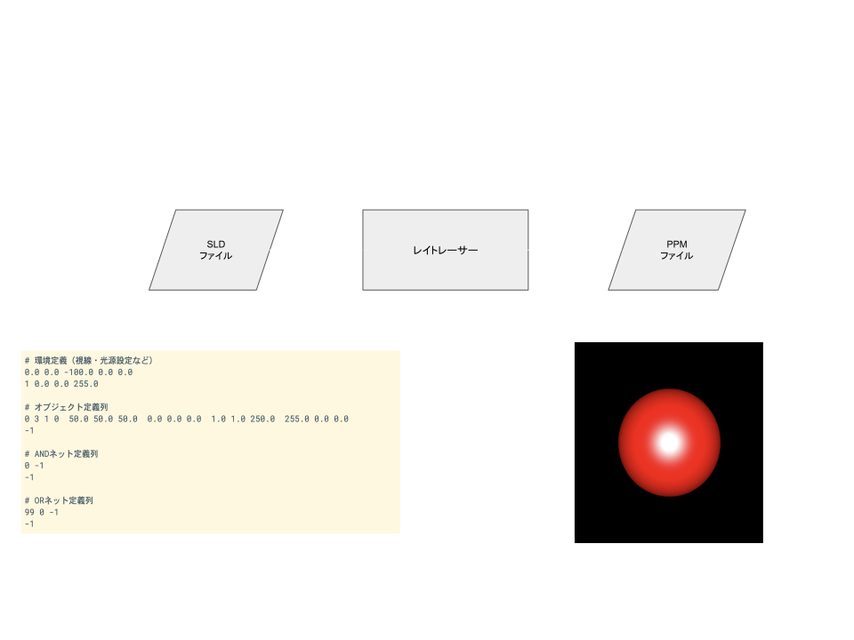

---

marp: true
paginate: true
theme: gaia
class:
  - invert

---

<!-- _class: lead invert -->

# 自作 CPU 上で 例のレイトレを動かした話 🚀

第5回 自作CPUを語る会
2025.04.12
@htkymtks

<!--
今日は

「自作CPU上で例のレイトレを動かした話」ということで、

東大CPU実験を真似て、自作CPUの上でレイトレーサーを動かしてみた話をしようと思います。
-->

<!--
アウトライン

- タイトル
    - 例のレイトレを自作CPUで動かした話
- 自己紹介
    - 畠山 貴（はたけやま たかし）
    - 永和システムマネジメント所属
    - RubyなどでWebアプリケーション開発をしている
    - 低レイヤーは趣味
- 今日お話しすること
    - 自作CPUを作り、その上でレイトレを動かすまでの流れ
    - 各ステップの課題と工夫
        - 自作CPUの設計と実装
        - MinCamlコンパイラの移植
        - ライブラリ関数の移植
        - レイトレの組み込みとデバッグ地獄
- 東大CPU実験とは？
    - 東大で行われる授業
        - 4人1組でCPUを設計
        - MinCamlコンパイラを改造し、自作CPU向けのアセンブリを出力
        - MinCaml製のレイトレーサーを実行し、速度を競う
            - レイトレーサーとは？
                - 3D空間のオブジェクトを定義したファイルをUARTから読み込み、それに対してレイトレーシングを行い、レイトレーシングの結果を画像ファイルとしてUARTへ出力するプログラム
            - レイトレーシングとは？
                - “光線を追跡することで3D空間上のオブジェクトの見え方をリアルにシミュレーションする手法。視点から光線を飛ばし、オブジェクトとの交差判定や反射・屈折を計算することで、影や反射などの効果を表現できる”
    - やばいポイント
        - CPU設計の解説なし。「自力でやれ」
        - 余裕のある班はUNIXを移植して遊ぶ
    - 始めたきっかけ
        - 東大CPU実験を個人で試してみたくなった
- 作成したCPU
    - 開発環境
        - FPGAボード
            - ULX3S
        - 合成・配置配線ツール
            - yosys + nextpnr
    - 必要なFPGAのスペック
        - （気になってる人も多いので最初に）
    - CPUアーキテクチャ
        - 32ビットRISC-V（RV32IFのサブセット）
            - 整数演算 + 単精度浮動小数点演算
        - 5ステージのマルチサイクル構成
            - Fetch → Decode → Execute → Memory → Writeback
        - 手抜き
            - パイプラインなし
            - 割り込みなし
            - クロックは25MHz（高速化したい！）
    - メモリ構成
        - ROM（ブロックRAM）：256KB
        - RAM（SDRAM）：32MB
        - メモリバス：PicoRV32 Native Memory Interface を利用
    - 周辺機器
        - 以下をメモリマップドIOで接続
            - UARTコントローラ
            - LEDコントローラ
    - 利用した既存のモジュール
        - FPU
            - https://github.com/dawsonjon/fpu
        - UART
            - https://github.com/freecores/osdvu
        - UART
            - https://github.com/freecores/osdvu
        - SDRAMコントローラ
            - https://github.com/machdyne/zucker/blob/main/rtl/sdram.v
    - 実装した命令
        - （あとで書く）
- MinCamlコンパイラの移植
    - MinCamlの概要
        - OCamlのサブセットな教育用コンパイラ
        - OCamlで書かれている
    - MinCamlはクロスコンパイラ
        - パソコンでコンパイラを実行し、ターゲット環境のアセンブリコードを出力
    - 対応しているCPUアーキテクチャ
        - UltraSPARC
        - PowerPC
        - x86
        - （ここにRISC-Vを追加したい）
- ライブラリ関数の移植
- レイトレの組み込みとデバッグ地獄
    - （ファームウェアの開発環境）
- 苦労したこととやって良かったこと
    - やってよかったこと
        - CPUが動いて例の画像が表示された瞬間の感動
        - 低レイヤの理解が深まった
- おすすめの資料
    - 本
    - ウェブサイト
-->

---

## 💎 自己紹介

- はたけやまたかし
- 株式会社永和システムマネジメント
  - RubyでWEBアプリケーション開発
- Twitter（現X）： @htkymtks
  

<!--
まず自己紹介です。

はたけやまたかしと申します。

株式会社永和システムマネジメントという会社で、プログラマとして、RubyでWEBアプリケーションを書く仕事をしています。

また、ダジャレが好きなので、思いついたダジャレをTwitterへ放流したりしています。

こちらは「最近のお気に入りツイート」になります。
-->

---

## 🦓 趣味

- 低レイヤプログラミング
  - 自作CPU
  - 自作RISC-Vシミュレーター
  - 自作コンパイラ

<!--
また、趣味で低レイヤプログラミングをしています。

FPGA上でCPUを自作したり、
RISC-Vのシミュレータを作ったり、
トイコンパイラを作って遊んでいたりします。
-->
---

## 💬 今日お話しすること

- 東大CPU実験とレイトレーシングについて
- CPUを自作してレイトレを動かすまでの流れ
- 苦労したことやハマりどころ

---

# 🗼東大CPU実験とは？

- 東大情報科学科の名物実験
- 自分たちでCPU、コンパイラ、シミュレーターを作成
- その上でレイトレーサーを動かして速さを競う

<!--
東大CPU実験について簡単に紹介します。

東大CPU実験とは、東京大学で情報科学科の名物実験で、4人1組のグループに分かれて、自分たちでCPUやコンパイラやシミュレータを作成し、最終的にはレイトレーサーを速く動かすのを目標とする実験だそうです。
-->

---

# 🌈 レイトレーサーとは？

- 物体と光源の光線の経路を追跡することで3D空間の見え方をシミュレートするソフトウェア
- MinCamlというプログラミング言語で書かれている

---

# 🌈 レイトレーサーの処理の流れ

<!-- * 3Dオブジェクト定義ファイルをUARTから読み込み
* レイトレーシングを実施
* 結果を画像ファイルとしてUARTへ出力
   -->

<!--
画面に表示する3Dオブジェクトの大きさ、向き、座標等を記述したSLDファイルをUARTから読み込み、

それを元にレイトレーシングを実施し、

その結果を画像ファイルへ出力します。
-->

---

# 🏃‍♀️ 始めたきっかけ

- CPUの創りかたのTD4
  - はんだ付け難しそう → FPGAならいけるかも → できた！
- 毎年見かけるCPU実験のブログ記事
  - TD4が作れたのなら、RISC-Vも作れるのでは？

---

# 🤖 作成した CPU
- 32ビット RISC-V
  - RV32IF（整数演算と単精度浮動小数点演算）
- 動作周波数：25MHz
- メモリ：256KB（FPGA ブロックRAM） + 64MB（SDRAM）
- ノイマンアーキテクチャ
  - プログラムメモリとデータメモリでアドレス空間を共有
- LUT数: 12000
  - TangNano 9Kには収まらない...

<!--
作成したCPUについて簡単に紹介します。

作成したCPUは、32ビットの RISC-V で、整数演算と単精度浮動小数点演算をサポートしています。

動作周波数は 25MHz で、メモリは FPGA のブロックRAM 256KB と、SDRAM 64MB が利用可能です。

アーキテクチャはノイマン型で、プログラムメモリとデータメモリが、同一のアドレス空間を共有しています。

ルックアップテーブル数は 12000 で、TangNano 9K には収まりませんでした。FPU が大きかったのかもしれません。
-->

---

# 🦊 MinCamlとレイトレーサー

- MinCamlコンパイラ
  - https://github.com/esumii/min-caml
  - CPU実験で作成するコンパイラのリファレンス実装
  - OCaml で書かれた OCaml のサブセット言語
  - 以下のアーキテクチャ向けのアセンブリを出力可能
    - PowerPC, UltraSPARC, x86
    - （ここに自分たちのアーキテクチャを追加するのがコンパイラ係の仕事）

---

# 🦊 MinCamlとレイトレーサー

- レイトレーサー
  - CPU実験のベンチマークプログラム
  - MinCamlで書かれている
    - https://github.com/esumii/min-caml/blob/master/min-rt/min-rt.ml
  - オブジェクト定義ファイルを読み込んでレイトレーシングを実行
    - 結果をPPMフォーマット(テキスト形式の画像フォーマット)で出力

<!--  -->

---

# 🔨CPU開発環境

- FPGAボード: Radiona ULX3S 85F（Lattice ECP5 を搭載）
  - 2021年: 1万8000円
  - 2025年: 3万8000円 💸💸💸
- 開発言語: System Verilog
- 開発ツール: yosys + nextpnr
  - オープンソースな合成+配置配線ツール
  - インストールが容易
  - macOS で動く🍎

<!--
利用している FPGA ボードは、Radiona 社の ULX3S 85F で、Lattice 社の ECP5 という FPGA チップを搭載しています。

ちなみにこの ULX3S、お気に入りのFPGAボードなのですが、2021年に購入当時は 1万8000円で購入できたのですが、2025年現在は 3万8000円に値上がりしています...

開発言語は System Verilog で、開発ツールはオープンソースな合成・配置配線ツールである yosys と nextpnr を利用しています。

yosys と nextpnr は、インストールが容易で、macOS ネイティブでも動作するので、手軽に FPGA 開発を行うことができて気に入っています。
-->

---

### 🙂 今日話すこと

- TinyRubyの紹介
- コンパイラ作成Tips
- コンパイラはじめの一歩

<!--
今日お話しすることは、

TinyRubyの紹介と、

TinyRubyの作成を通じて得た「コンパイラ作成の便利情報、Tips」について、

そして、「コンパイラの初めの一歩」ということで、実際にコンパイラを作成する流れをお見せしたいと思います。
-->

---

<!-- _class: lead invert -->

### 提供

# 株式会社 永和システムマネジメント

  

---

以下、ボツスライド

---

# 👨‍👩‍👧‍👦 東大CPU実験の4つの班

- コア係（HDL を書いて CPU を作る）
- コンパイラ係（MinCamlコンパイラの移植）
- シミュレータ係（デバッグ用のシミュレータとアセンブラの作成）
- FPU係（浮動小数点演算器とライブラリ関数(sin, cos など)の作成）

<!--
CPU実験では4人のメンバーが4つの班に分かれて、それぞれの役割を担当します。

1つめは「コア係」で、Verilog HDL を書いて CPU を作成し、FPGA 上で動かします。
2つめは「コンパイラ係」で、MinCaml という言語のコンパイラを、自分たちの CPU 向けのアセンブリコードを出力するよう改造します。
3つめは「シミュレータ係」で、デバッグ用のシミュレータを作成します。自分たちの CPU 向けのアセンブラを用意するのもシミュレータ係の役割です。
4つめは「FPU係」で、レイトレーサーの中で浮動小数点演算を行なっているので、そのための浮動小数点演算器 FPU を作成します。また浮動小数点演算を行うライブラリ関数、sin 関数や cos 関数なども作成します。
-->

---

# 👨‍👩‍👧‍👦 やったこと

- コア係 → ⭕️ RISC-V CPUを作成
- コンパイラ係　→ ⭕️ MinCamlコンパイラを移植
- シミュレータ係
  - シミュレータ → 既存の RISC-V シミュレータ（Spike）を利用
  - アセンブラ・リンカ → RISC-V GNUツールチェインのものを利用
- FPU係
  - FPU → 既存の FPU コアを利用
  - ライブラリ関数 → ⭕️ 書いた

<!--
4つの係のうち、私が行ったのは「コア係」のCPU作成と、「コンパイラ係」のMinCamlコンパイラの移植のふたつです。

シミュレータは RISC-V GNU ツールチェインに付属の Spike シミュレータを利用しました。

また、FPU は、Github で公開されいる FPU コアのうち、良さげなものをみつくろって利用しました。
-->
