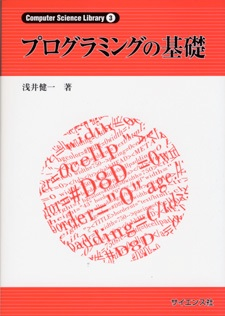
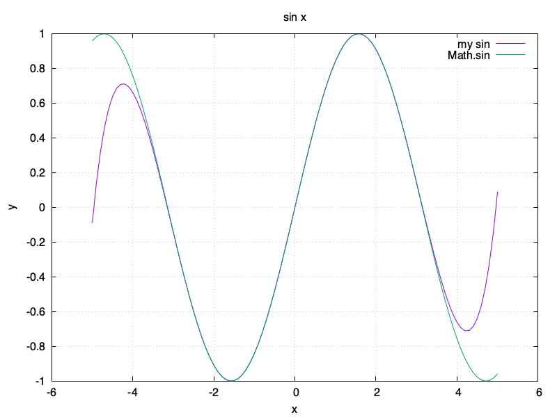
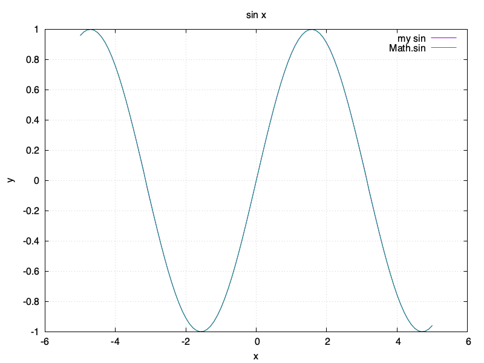
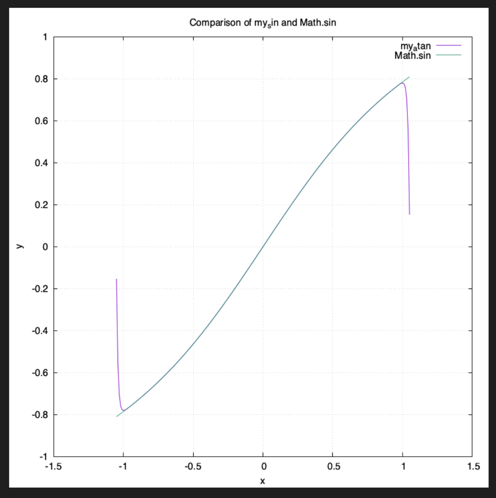
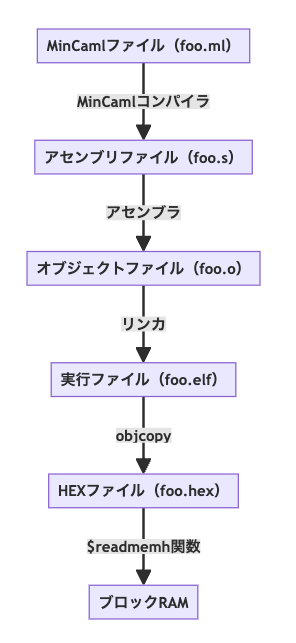
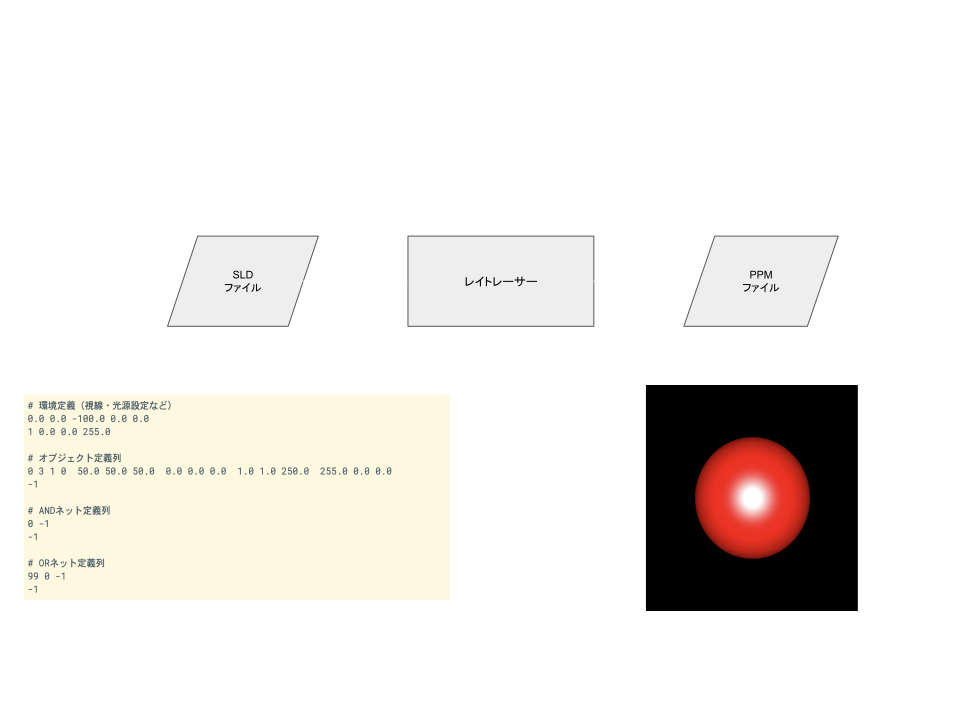

---

marp: true
paginate: true
theme: gaia
class:
  - invert
math: mathjax
---

<!-- _class: lead invert -->

# 自作 CPU 上で<br/>例のレイトレを動かした話 🚀

第5回 自作CPUを語る会
2025.04.12
@htkymtks

---

## 自己紹介

はたけやまです。

---

## アジェンダ

自作CPUを作って、その上で東大CPU実験で有名な例のレイトレーサーを動かしました。CPUを作成してレイトレを動かすまでの流れを紹介しつつ、苦労したことやハマリどころなどをお話しします。

---

## 東大CPU実験

東京大学情報科学科の名物実験で、自分たちでCPUやコンパイラやシミュレータを作成し、最終的には自作CPUの上でレイトレーサーを速く動かすのを目標とする実験です。

例のレイトレーサーでおなじみ。

---

## CPU実験の４つの係

- コア係
  - FPGAボード上でHDLでCPUを実装
- コンパイラ係
  - MinCamlコンパイラを、自分たちのCPU向けに移植
- シミュレータ係
  - デバッグ用のシミュレータとアセンブラの作成
- FPU係
  - 浮動小数点演算器の作成
  - ライブラリ関数の実装

---

## CPU実験の４つの係

- コア係 → ✅CPUを実装
- コンパイラ係 → ✅MinCamlコンパイラを移植
- シミュレータ係 → ❌既存のRISC-Vシミュレータを利用
- FPU係
  - 浮動小数点演算器 → ❌既存のFPUコアを利用
  - ライブラリ関数の実装 → ✅実装する

---

## レイトレを動かす手順

- 1️⃣ FPGAボードを用意
- 2️⃣ CPUを作成
- 3️⃣ MinCamlコンパイラの移植
- 4️⃣ ライブラリ関数の実装
- 5️⃣ レイトレの組み込み

---

<!-- _class: lead invert -->

# 1️⃣ FPGAボードを用意

---

## 使ってるFPGAボード

<!--
まずはFPGAボードを用意します。私が使っているFPGAボードは「ULX3S」という、Lattice ECP5 を搭載したボード。以下のようなスペックを持ちます。

ちなみにこの ULX3S、お気に入りのFPGAボードなのですが、2021年に購入当時は 1万8000円で購入できたのですが、2025年現在は 3万8000円に値上がりしています...
-->


- Radiona ULX3S 85F
  - FPGA： Lattice ECP5
  - LUT数： 85K LUT
  - SDRAM： 32MB
  - ブロックRAM： 486KB
- 価格
  - 2021年: 1万8000円
  - 2025年: 3万8000円 💸💸💸

---

## ULX3S 以外でもいける？

以下の条件を満たせば他のFPGAボードでも大丈夫そう

- 必須
  - LUT数: 12000（作成したCPUが 1万2000 LUT）
    - ❌ Tang Nano 9K、✅ Tang Primer 20K
  - SDRAM: 5MB以上（スタック1MB + ヒープ4MBが必要）
- 推奨
  - ブロックRAM: 250KB以上（レイトレのサイズがこれくらい）
    - 足りなければブートローダーが必要

---

<!-- _class: lead invert -->

# 2️⃣ CPUの作成

---

## CPUのスペック

- CPUアーキテクチャ
  - 32ビットRISC-V（RV32IF）
    - 整数演算 + 単精度浮動小数点演算
- メモリ構成
  - ROM（ブロックRAM）：256KB
  - RAM（SDRAM）：32MB
- 周辺機器
  - UART
  - LED（8ビット）

<!--
今回作成したCPUのアーキテクチャには、32ビットRISC-V（RV32IF）を採用しました。

RISC-Vを採用した理由は、x86やARMなどと比べて仕様がシンプルなので実装しやすく、コンパイラやシミュレータなどのツールチェインが最初から揃っているのが便利だから。
-->

---

## メモリマップ

- プログラムは0番地からスタート
- SDRAMの領域はヒープとスタックの領域
- UARTやLEDはメモリマップトI/Oでアクセス

| 開始アドレス | 終了アドレス | サイズ   | 説明                          |
|--------------|--------------|----------|-------------------------------|
| 0x00000000     | 0x0003ffff     | 256KB    | ブロックRAM領域（プログラム/データ） |
| 0x40000000     | 0x4fffffff     | 64MB     | SDRAM領域（ヒープ/スタック）           |
| 0xf0000000     | 0xf0000000     | 1        | UART データレジスタ                   |
| 0xf0000004     | 0xf0000004     | 1        | UART コントロールレジスタ             |
| 0xf0001000     | 0xf0001000     | 1        | LED コントロールレジスタ              |

<style scoped>
  section table { font-size: 0.8em; }
</style>

---

## 開発ツール

- HDL
  - System Verilog
- 合成ツール
  - yosys
- 配置配線ツール
  - nextpnr

OSS CAD Suite をインストールすると全部ついてくる

---

## CPUの作り方

- 以下の本を参考にすれば、ある程度は作れる
  - ディジタル回路設計とコンピュータアーキテクチャ（RISC-V版）
  - RISC-V原典
  - FPGA Prototyping by SystemVerilog Examples: Xilinx MicroBlaze MCS SoC Edition

---

## 既存のものを利用

- FPUコア
  - https://github.com/dawsonjon/fpu
- UARTコントローラ
  - https://github.com/freecores/osdvu
- SDRAMコントローラ
  - https://github.com/machdyne/zucker/blob/main/rtl/sdram.v

---

## 実装した命令一覧

- 整数命令（RV32Iのサブセット）
  - lw, sw, add, addi, sub, and, or, xor, slt, sltu, beq, bne, ble, bne, blt, bgt, bge, jal, jalr, lui, auipc, ori, srl, sra, sll
- 浮動小数点命令（RV32Fのサブセット）
  - flw, fsw, fadd_s, fsub_s, fmul_s, fdiv_s, fcvt_s_w, fcvt_w_s, fsgnj_s, fsgnjn_s, feq_s, flt_s, fle_s, fmv_x_w, fmv_w_x

---

<!-- _class: lead invert -->

# 3️⃣ MinCamlコンパイラの移植

---

## MinCamlとは

- https://github.com/esumii/min-caml
- 教育用コンパイラ
- OCamlのサブセット
- MinCamlはOCamlで書かれている

<!--
MinCamlは教育用のコンパイラで、東大のコンパイラの授業などで使われています。
MinCamlはOCamlという言語のサブセットで、MinCaml自身もOCamlで書かれています。
-->

---

## MinCamlとレイトレ
- CPU実験のレイトレはMinCaml製
- MinCamlを自作CPUへ移植することで、自作CPUの上でレイトレが動く

<!--
CPU実験のレイトレーサーはMinCamlで書かれていて、MinCamlコンパイラを自作CPUへ移植することで、自作CPUの上でレイトレーサーを動かすことができます。
-->

---

## MinCamlの対応アーキテクチャ

オリジナルのMinCamlの対応CPUアーキテクチャは以下の3つ

- UltraSPARC
- PowerPC
- 32ビット x86
- （ここにRISC-Vを追加する）

---

### アーキテクチャ依存コードの置き場所

- 📂 min-caml/
  - 📁 SPARC/
  - 📁 x86/
  - 📂 PowerPC/
    - 📄 emit.ml （アセンブリコード生成部）
    - 📄 libmincaml.S （ライブラリ関数）
    - 📄 asm.ml
    - 📄 ...

<!--
CPUアーキテクチャに依存したコードは以下のディレクトリへ配置される
-->

---

### コンパイラ移植の流れ

- 📂 min-caml/
  - 📁 PowerPC/
  - 📂 RV32/ （1️⃣ PowerPCディレクトリを複製）
    - 📄 asm.ml （2️⃣ レジスタ一覧を修正）
    - 📄 emit.ml （3️⃣ 埋まってるアセンブリをRISC-Vに修正）
    - 📄 libmincaml.S （4️⃣ ライブラリ関数をRISC-Vで書き換え）
    - 📄 ...

<!--
MinCamlをRISC-Vへ移植する手順としては、

まず最初にPowerPCの依存コードディレクトリをRISC-Vディレクトリとして複製し、

次に、asm.ml 内のレジスタ一覧を、RISC-Vで利用するレジスタに修正し、

次に、emit.ml がアセンブリコード生成部なので、ここに埋まっているPowerPCのアセンブリをRISC-Vのアセンブリに置き換えていき、

libmincaml.S で定義されているMinCamlのライブラリ関数をRISC-Vで動くように修正していきます。
-->

---

## MinCamlの開発環境

- OCaml
  - MinCaml自体がOCamlで書かれている
- RISC-V GNUツールチェイン
  - Cコンパイラ、アセンブラ、リンカ、その他バイナリユーティリティ等
  - シミュレータ（Spike）も付属

---

## MinCamlコンパイラの移植で困ったこと

- OCamlわからん
- アセンブリわからん

---

## OCamlわからん



- MinCamlはOCamlで書かれている
- OCamlは独特な世界観でとっつきづらい
- プログラミングの基礎（通称：浅井本）がオススメ
  - プログラミングの初心者向けの本ではあるが、関数型プログラミングやOCamlの初心者にもおすすめ
  - OCamlの入門をいくつか読んでもピンと来なかったが、この本の練習問題をこなしてるうちにMinCamlのソースが読めるようにようになった

---

## アセンブリわからん

アセンブリの書き方に悩んだら、Cコンパイラが出力するアセンブリを確認する

- 2つの確認方法
  - Compiler Explorer
  - GCCの -S オプション

<!--
アセンブリ、わかんないですよね。

アセンブリの書き方に悩んだら、Cコンパイラが出力するアセンブリを確認するのがオススメです。

おすすめの確認方法は以下の2つ。
  - Compiler Explorer
  - GCCの -S オプション
-->

---

<style scoped> section { font-size: 2.0em; } </style>

## ⚡️ Compiler Explorer（ https://godbolt.org/ ）

様々な言語・様々なCPUのアセンブリ出力を確認できる神サイト
<video src="godbolt.mov"   width="800" controls></video>

<!--
まずは Compiler Explorer を使う方法を紹介します。

Compiler Explorer は、様々な言語、様々なCPUが出力するアセンブリを確認できるカッコいいサイトです。

（動画を再生）

・Compiler Explorer の画面は2つの領域に分かれていて、左側にはソースプログラムを書くと、右側にそのソースのアセンブリが出力されます。

・Cのソースプログラムのどの部分が、アセンブリコードのどの部分に対応しているかが、色によってわかりやすく表示されるので、アセンブリの理解に役立ちます。
-->

---

## 🐃 GCCの -S オプション

GCC の `-S` オプションで、Cからアセンブリを出力できる

```c
// test.c
int return_100() {
  return 100;
}
```

```sh
$ gcc -S -masm=intel test.c
```

<!--
次に、GCCの「-S」オプションを使う方法を紹介します。

通常、GCCにC言語のソースコードを渡すと、実行ファイルやオブジェクトファイルが生成されます。

しかし、gcc に「-S」オプションを付けることで、コンパイルのみを行い、その結果をアセンブリファイルとして出力することができます。

例えば、次のようなC言語のソースコードを「-S」オプションをつけて実行すると...（次のページ）
-->

---

## 🐃🐃 GCCの `-S` オプション

出力されたアセンブリコード

```sh
$ gcc -S -masm=intel test.c
$ cat test.s
	.intel_syntax noprefix
	.text
	.globl	return_100
	.type	return_100, @function
return_100:
	push	rbp
	mov	rbp, rsp
	mov	eax, 100
	pop	rbp
	ret
```

<!--
このようなアセンブリコードが出力されます。
-->

---

## ⚡️🐃 Compiler Explorer と GCC の使い分け

Compiler Explorer が出力したアセンブリは、出力オプションやプラットフォームの違いで、そのままでは動かないことがある

- 出力したアセンブリをそのままビルドにかけたい場合
  - → GCC
- それ以外
  - → Compiler Explorer

<!--
「Compiler Explorer」と「GCC」の使い分けについてです。

基本的には「Compiler Explorer」を使っておけばOKですが、

Compiler Explorer が出力するアセンブリは、出力オプションに

Compiler Explorer が出力したアセンブリは、出力オプションの設定によっては、そのままビルドできないことがままあります。

そのため、出力したアセンブリをそのままビルドにかけたい場合などは「GCC」で。

そうでない場合は「Compiler Explorer」を使うと良いでしょう。
-->

---

<!-- _class: lead invert -->

# 4️⃣ ライブラリ関数の実装

---

## 必要なライブラリ関数

<!--
MinCamlの移植が終わったら、次はレイトレから呼び出すライブラリ関数の実装を行います。

これらが14個の関数が、実装が必要なライブラリ関数になります。
-->

- 入出力関数
  - print_int, read_int, print_byte, read_byte, read_float
- 三角関数
  - sin, cos, atan
- 平方根
  - sqrt
- その他浮動小数点関数
  - floor, abs_float, float_of_int, int_of_float

---

## ライブラリの実装言語

- オリジナルのMinCamlのライブラリ
  - アセンブリで実装
  - libmincaml.S
- 移植したMinCamlのライブラリ
  - MinCamlで実装（一部アセンブリ）
  - min-rt/min-rt.ml と libmincaml.S

<!--
オリジナルのMinCamlでは、ライブラリ関数は libmincaml.S でアセンブリ言語で実装されていますが、アセンブリで実装するのは結構大変なので、レイトレーサーのMinCamlファイルにライブラリ関数を直接追加するのが簡単で良かったです
-->

---

## 入出力関数

入出力関数は、UARTを利用して入出力を行う

- print_int
- read_int
- print_byte
- read_byte
- read_float

---

## 平方根を求める sqrt 関数

<!--
平方根を求める sqrt 関数は「Babylonian method」と呼ばれるアルゴリズムを使うと簡単に実装できて良かったです。
-->

- Babylonian method
  - https://cpplover.blogspot.com/2010/11/blog-post_20.html

```ruby
 def sqrt(s)
   x = s / 2.0
   last_x = 0.0

   while x != last_x
     last_x = x
     x = (x + s / x) / 2.0
   end
   x
 end
```

---

## 三角関数

<!--
三角関数 sin/cos/atan はマクローリン展開を使って計算することができます。
-->

- sin
- cos
- atan

---

## マクローリン展開

<!-- cos x のマクローリン展開 -->
$$
\cos x = 1 - \frac{1}{2!} x^2 + \frac{1}{4!} x^4 - \frac{1}{6!} x^6 + \cdots
$$

<!-- sin x のマクローリン展開 -->
$$
\sin x = x - \frac{1}{3!} x^3 + \frac{1}{5!} x^5 - \frac{1}{7!} x^7 + \cdots
$$

<!-- atan x のマクローリン展開 -->
$$
\arctan x = x - \frac{1}{3} x^3 + \frac{1}{5} x^5 - \frac{1}{7} x^7 + \cdots
$$

---

### sin 関数

```ruby
def sin(x)
  x = adjustx(x) # x の値が -π から π の間に収まるように調整
  x2 = x * x
  x3 = x2 * x
  x5 = x3 * x2
  x7 = x5 * x2
  x9 = x7 * x2
  x - x3 / 6 + x5 / 120 - x7 / 5040 + x9 / 362880
end
```

---

## 角度の調整

xの値が0から離れるほど誤差が大きくなる


<!--
マクローリン展開で求めたsinやcosは、xの値が0から離れるほど誤差が大きくなります
-->

---

## 角度の調整
sinやcosは同じ波が繰り返されるので、xの値を-3.14から3.14の間に収まるよう調整

<div class="graph">
  <div class="graph-item">
    <div class="graph-col">
      
    </div>
    <div class="graph-col graph-label">
      （角度調整前）
    </div>
  </div>
  <div class="graph-item">
    <div class="graph-col">
      
    </div>
    <div class="graph-col graph-label">
    （角度調整後）
    </div>
  </div>
</div>

<style scoped>
  section .graph {
    display: flex;
  }
  section .graph-item {
  }
  section .graph-label {
    font-size: 0.5em;
    padding-left: 170px;
  }
</style>

---

## atan関数

（うまく実装できなかったので、1.0 を返してお茶を濁した...）

```ocaml
let rec atan x = 1.0 in
```

<br/>


<!--
atan関数はうまく実装できなかったのですが、実際には呼ばれてなさそうだったので、適当な値を返してお茶を濁しました...
-->

---

## その他浮動小数点関数

- float_of_int → （FPUを呼び出し）
- int_of_float → （FPUを呼び出し）
- floor → （int_of_float を使えば簡単）
- abs_float → （符号ビットに0（正）をセットするだけ）

---

<style scoped>
  section .image-center {
    display: flex;
    justify-content: center;
  }
</style>

### ライブラリ関数の参考資料

- CPU実験の浮動小数点数演算について
  - https://nekketsuuu.github.io/entries/2015/12/11/cpu-experiment-floats.html

<div class="image-center">
  
</div>

---

<!-- _class: lead invert -->

# 5️⃣ レイトレの組み込み

<!--
コンパイラができたら、自作CPUへレイトレを組み込みます
-->

---

## プログラム書き込みの流れ

<!--
自作CPUへMinCamlで書かれたプログラムを組み込む流れは、以下のとおり。

* MinCamlのプログラムをコンパイルして、アセンブリファイルを生成
* アセンブリファイルをアセンブルして、オブジェクトファイルを生成
* オブジェクトファイルをリンクして、ELFフォーマットの実行ファイルを生成
* 実行ファイルから、objcopy コマンドを使ってプログラムとデータを抽出して、HEXファイルとして保存
* Verilog の $readmemh 関数を使って、FPGAのブロックRAMをHEXファイルで初期化

CPUは起動時にブロックRAMに書き込まれたプログラムを読み込んで、処理を実行します。
-->

<div class="image-center">
  
</div>

<style scoped >
  section .image-center {
    display: flex;
    justify-content: center;
  }
  section .image-center img {
    height: 550px;
  }
</style>

---

## ブロックRAMの容量とバイナリサイズ

- ULX3SのブロックRAMサイズ → 400KB程度
- レイトレのバイナリサイズ → 200KB程度
- レイトレがブロックRAMに収まる場合
  - ブロックRAMからレイトレを起動可能
- 収まらない場合
  - プログラムローダーが必要
    - UARTやSDカードからプログラムを読み込み、SDRAMへ転送

---

#### レイトレの実行

<!--
レイトレの実行結果がUARTから渡されてくるので、ちょっとしたスクリプトを使って受信してファイルへ出力する。
-->

```ruby
 # レイトレサーバ
 #  usage: ruby script/server.rb > contest.ppm

 require 'rubyserial'

 begin
   serialport = Serial.new '/dev/cu.usbserial-D00084', 115200

   # 不要なデータを読み捨て
   while serialport.getbyte
     # 何もしない
   end

   # 自作CPUに送信開始を依頼
   serialport.write " "

   # UART読み込み
   while true
     puts serialport.gets
     $stderr.puts "receiving..."
   end
 rescue Interrupt
   serialport.close
 end
```


---

## （以下古いやつ）

<!--
アウトライン

- タイトル
    - 例のレイトレを自作CPUで動かした話
- 自己紹介
    - 畠山 貴（はたけやま たかし）
    - 永和システムマネジメント所属
    - RubyなどでWebアプリケーション開発をしている
    - 低レイヤーは趣味
- 今日お話しすること
    - 自作CPUを作り、その上でレイトレを動かすまでの流れ
    - 各ステップの課題と工夫
        - 自作CPUの設計と実装
        - MinCamlコンパイラの移植
        - ライブラリ関数の移植
        - レイトレの組み込みとデバッグ地獄
- 東大CPU実験とは？
    - 東大で行われる授業
        - 4人1組でCPUを設計
        - MinCamlコンパイラを改造し、自作CPU向けのアセンブリを出力
        - MinCaml製のレイトレーサーを実行し、速度を競う
            - レイトレーサーとは？
                - 3D空間のオブジェクトを定義したファイルをUARTから読み込み、それに対してレイトレーシングを行い、レイトレーシングの結果を画像ファイルとしてUARTへ出力するプログラム
            - レイトレーシングとは？
                - “光線を追跡することで3D空間上のオブジェクトの見え方をリアルにシミュレーションする手法。視点から光線を飛ばし、オブジェクトとの交差判定や反射・屈折を計算することで、影や反射などの効果を表現できる”
    - やばいポイント
        - CPU設計の解説なし。「自力でやれ」
        - 余裕のある班はUNIXを移植して遊ぶ
    - 始めたきっかけ
        - 東大CPU実験を個人で試してみたくなった
- 作成したCPU
    - 開発環境
        - FPGAボード
            - ULX3S
        - 合成・配置配線ツール
            - yosys + nextpnr
    - 必要なFPGAのスペック
        - （気になってる人も多いので最初に）
    - CPUアーキテクチャ
        - 32ビットRISC-V（RV32IFのサブセット）
            - 整数演算 + 単精度浮動小数点演算
        - 5ステージのマルチサイクル構成
            - Fetch → Decode → Execute → Memory → Writeback
        - 手抜き
            - パイプラインなし
            - 割り込みなし
            - クロックは25MHz（高速化したい！）
    - メモリ構成
        - ROM（ブロックRAM）：256KB
        - RAM（SDRAM）：32MB
        - メモリバス：PicoRV32 Native Memory Interface を利用
    - 周辺機器
        - 以下をメモリマップドIOで接続
            - UARTコントローラ
            - LEDコントローラ
    - 利用した既存のモジュール
        - FPU
            - https://github.com/dawsonjon/fpu
        - UART
            - https://github.com/freecores/osdvu
        - UART
            - https://github.com/freecores/osdvu
        - SDRAMコントローラ
            - https://github.com/machdyne/zucker/blob/main/rtl/sdram.v
    - 実装した命令
        - （あとで書く）
- MinCamlコンパイラの移植
    - MinCamlの概要
        - OCamlのサブセットな教育用コンパイラ
        - OCamlで書かれている
    - MinCamlはクロスコンパイラ
        - パソコンでコンパイラを実行し、ターゲット環境のアセンブリコードを出力
    - 対応しているCPUアーキテクチャ
        - UltraSPARC
        - PowerPC
        - x86
        - （ここにRISC-Vを追加したい）
- ライブラリ関数の移植
- レイトレの組み込みとデバッグ地獄
    - （ファームウェアの開発環境）
- 苦労したこととやって良かったこと
    - やってよかったこと
        - CPUが動いて例の画像が表示された瞬間の感動
        - 低レイヤの理解が深まった
- おすすめの資料
    - 本
    - ウェブサイト
-->

---

# 開発環境の構築

- ハードウェア開発環境
- ソフトウェア開発環境

---

## ハードウェア開発環境

開発言語は System Verilog で、開発ツールはオープンソースな合成・配置配線ツールである yosys と nextpnr を利用しています。

yosys と nextpnr は、インストールが容易で、macOS ネイティブでも動作するので、手軽に FPGA 開発を行うことができて気に入っています。

- HDL: System Verilog
- 開発ツール: yosys + nextpnr
  - オープンソースな合成+配置配線ツール
  - macOS で動く🍎

---

## ソフトウェア開発環境

- OCaml（MinCamlコンパイラの作成に利用）
- RISC-V GNU ツールチェイン（アセンブラ、リンカ等）

---

## 💎 自己紹介

- はたけやまたかし
- 株式会社永和システムマネジメント
  - RubyでWEBアプリケーション開発
- Twitter（現X）： @htkymtks
  

<!--
まず自己紹介です。

はたけやまたかしと申します。

株式会社永和システムマネジメントという会社で、プログラマとして、RubyでWEBアプリケーションを書く仕事をしています。

また、ダジャレが好きなので、思いついたダジャレをTwitterへ放流したりしています。

こちらは「最近のお気に入りツイート」になります。
-->

---

## 趣味

- 低レイヤプログラミング
  - 自作CPU
  - 自作RISC-Vシミュレーター
  - 自作コンパイラ

<!--
また、趣味で低レイヤプログラミングをしています。

FPGA上でCPUを自作したり、
RISC-Vのシミュレータを作ったり、
トイコンパイラを作って遊んでいたりします。
-->
---

## 今日お話しすること

- 東大CPU実験とレイトレーシングについて
- CPUを自作してレイトレを動かすまでの流れ
- 苦労したことやハマりどころ

---

# 🗼東大CPU実験とは？

- 東大情報科学科の名物実験
- 自分たちでCPU、コンパイラ、シミュレーターを作成
- その上でレイトレーサーを動かして速さを競う


<!--
東大CPU実験について簡単に紹介します。

東大CPU実験とは、東京大学で情報科学科の名物実験で、4人1組のグループに分かれて、自分たちでCPUやコンパイラやシミュレータを作成し、最終的にはレイトレーサーを速く動かすのを目標とする実験だそうです。
-->

---

# 🌈 レイトレーサーとは？

- 物体と光源の光線の経路を追跡することで3D空間の見え方をシミュレートするソフトウェア
- MinCamlというプログラミング言語で書かれている

---

# 🌈 レイトレーサーの処理の流れ




<!-- * 3Dオブジェクト定義ファイルをUARTから読み込み
* レイトレーシングを実施
* 結果を画像ファイルとしてUARTへ出力
   -->

<!--
画面に表示する3Dオブジェクトの大きさ、向き、座標等を記述したSLDファイルをUARTから読み込み、

それを元にレイトレーシングを実施し、

その結果を画像ファイルへ出力します。
-->


---

# 🏃‍♀️ 始めたきっかけ

- CPUの創りかたのTD4
  - はんだ付け難しそう → FPGAならいけるかも → できた！
- 毎年見かけるCPU実験のブログ記事
  - TD4が作れたのなら、RISC-Vも作れるのでは？


---

# 🤖 作成した CPU
- 32ビット RISC-V
  - RV32IF（整数演算と単精度浮動小数点演算）
- 動作周波数：25MHz
- メモリ：256KB（FPGA ブロックRAM） + 64MB（SDRAM）
- ノイマンアーキテクチャ
  - プログラムメモリとデータメモリでアドレス空間を共有
- LUT数: 12000
  - TangNano 9Kには収まらない...

<!--
作成したCPUについて簡単に紹介します。

作成したCPUは、32ビットの RISC-V で、整数演算と単精度浮動小数点演算をサポートしています。

動作周波数は 25MHz で、メモリは FPGA のブロックRAM 256KB と、SDRAM 64MB が利用可能です。

アーキテクチャはノイマン型で、プログラムメモリとデータメモリが、同一のアドレス空間を共有しています。

ルックアップテーブル数は 12000 で、TangNano 9K には収まりませんでした。FPU が大きかったのかもしれません。
-->

---

# 🦊 MinCamlとレイトレーサー

- MinCamlコンパイラ
  - https://github.com/esumii/min-caml
  - CPU実験で作成するコンパイラのリファレンス実装
  - OCaml で書かれた OCaml のサブセット言語
  - 以下のアーキテクチャ向けのアセンブリを出力可能
    - PowerPC, UltraSPARC, x86
    - （ここに自分たちのアーキテクチャを追加するのがコンパイラ係の仕事）

---

# 🦊 MinCamlとレイトレーサー


- レイトレーサー
  - CPU実験のベンチマークプログラム
  - MinCamlで書かれている
    - https://github.com/esumii/min-caml/blob/master/min-rt/min-rt.ml
  - オブジェクト定義ファイルを読み込んでレイトレーシングを実行
    - 結果をPPMフォーマット(テキスト形式の画像フォーマット)で出力

<!--  -->


---

# 🔨CPU開発環境

- FPGAボード: Radiona ULX3S 85F（Lattice ECP5 を搭載）
  - 2021年: 1万8000円
  - 2025年: 3万8000円 💸💸💸
- 開発言語: System Verilog
- 開発ツール: yosys + nextpnr
  - オープンソースな合成+配置配線ツール
  - インストールが容易
  - macOS で動く🍎

<!--
利用している FPGA ボードは、Radiona 社の ULX3S 85F で、Lattice 社の ECP5 という FPGA チップを搭載しています。

ちなみにこの ULX3S、お気に入りのFPGAボードなのですが、2021年に購入当時は 1万8000円で購入できたのですが、2025年現在は 3万8000円に値上がりしています...

開発言語は System Verilog で、開発ツールはオープンソースな合成・配置配線ツールである yosys と nextpnr を利用しています。

yosys と nextpnr は、インストールが容易で、macOS ネイティブでも動作するので、手軽に FPGA 開発を行うことができて気に入っています。
-->

---

### 🙂 今日話すこと

- TinyRubyの紹介
- コンパイラ作成Tips
- コンパイラはじめの一歩

<!--
今日お話しすることは、

TinyRubyの紹介と、

TinyRubyの作成を通じて得た「コンパイラ作成の便利情報、Tips」について、

そして、「コンパイラの初めの一歩」ということで、実際にコンパイラを作成する流れをお見せしたいと思います。
-->

---

<!-- _class: lead invert -->

### 提供

# 株式会社 永和システムマネジメント

  

---

以下、ボツスライド

---

# 👨‍👩‍👧‍👦 東大CPU実験の4つの班

- コア係（HDL を書いて CPU を作る）
- コンパイラ係（MinCamlコンパイラの移植）
- シミュレータ係（デバッグ用のシミュレータとアセンブラの作成）
- FPU係（浮動小数点演算器とライブラリ関数(sin, cos など)の作成）

<!--
CPU実験では4人のメンバーが4つの班に分かれて、それぞれの役割を担当します。

1つめは「コア係」で、Verilog HDL を書いて CPU を作成し、FPGA 上で動かします。
2つめは「コンパイラ係」で、MinCaml という言語のコンパイラを、自分たちの CPU 向けのアセンブリコードを出力するよう改造します。
3つめは「シミュレータ係」で、デバッグ用のシミュレータを作成します。自分たちの CPU 向けのアセンブラを用意するのもシミュレータ係の役割です。
4つめは「FPU係」で、レイトレーサーの中で浮動小数点演算を行なっているので、そのための浮動小数点演算器 FPU を作成します。また浮動小数点演算を行うライブラリ関数、sin 関数や cos 関数なども作成します。
-->

---

# 👨‍👩‍👧‍👦 やったこと

- コア係 → ⭕️ RISC-V CPUを作成
- コンパイラ係　→ ⭕️ MinCamlコンパイラを移植
- シミュレータ係
  - シミュレータ → 既存の RISC-V シミュレータ（Spike）を利用
  - アセンブラ・リンカ → RISC-V GNUツールチェインのものを利用
- FPU係
  - FPU → 既存の FPU コアを利用
  - ライブラリ関数 → ⭕️ 書いた

<!--
4つの係のうち、私が行ったのは「コア係」のCPU作成と、「コンパイラ係」のMinCamlコンパイラの移植のふたつです。

シミュレータは RISC-V GNU ツールチェインに付属の Spike シミュレータを利用しました。

また、FPU は、Github で公開されいる FPU コアのうち、良さげなものをみつくろって利用しました。
-->
